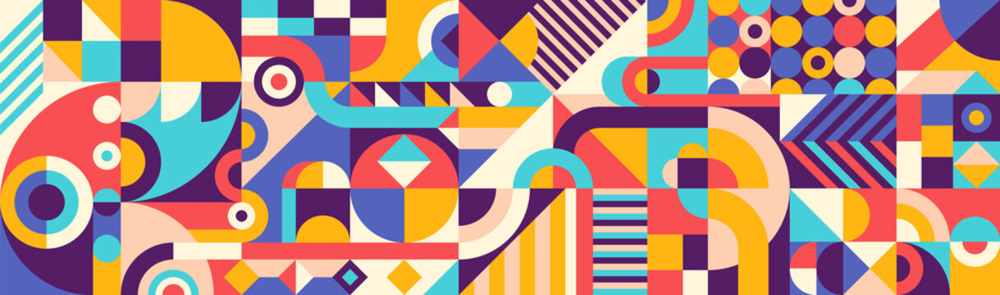

# Design-Patterns-Course

This repository i used to teach Design Patterns to my Reactjs Course students as learn as well

## 💻 Programming Languages

- Javascript
- Typescript

## 📚 Libraries & frameworks

- Node.Js

## 🧠 What i will learn

- [X] What is Design Patterns
- [X] The GOF Concepts
- [X] SOLID Principles
- [X] Criiattional Design patterns
    - [X] Factory
    - [X] Abstract Factory
    - [X] Builder
- [x] Structural Design Patterns
    - [X] Adapter
    - [X] Bridge
- [x] Behavioral Design Patterns
    -[X] Chain Responsablity

